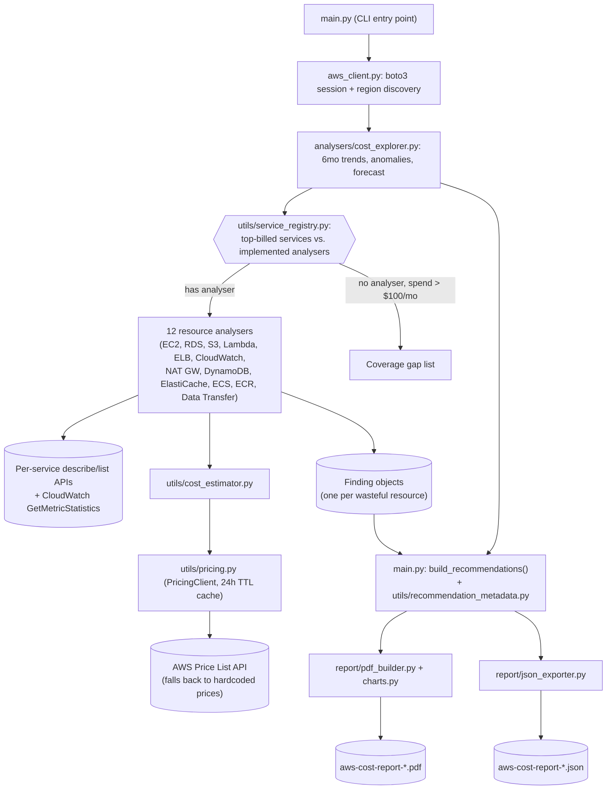

# AWS Cost Optimisation Tool

[](https://github.com/soodrajesh/aws-cost-optimization/actions/workflows/ci.yml)

A Python CLI that scans an AWS account for cost waste and turns it into a PDF a customer or a CTO will actually read. I built this after doing a few cost reviews manually with Cost Explorer exports and spreadsheets — the data-gathering part is repetitive and mechanical, so I automated it, and kept a human in the loop for everything that isn't (deciding what's actually safe to delete or resize).

It is a point-in-time audit tool, not a monitoring service: you run it against a read-only profile, it produces a report, you act on the report. There's no persistent infrastructure, no scheduler, and it never calls a mutating AWS API.

## What it does

- Pulls 6 months (configurable) of spend by service from Cost Explorer, computes month-over-month trend and flags anomalous months (spend > mean + 2 stddev).
- Cross-references the highest-billed services against a registry of implemented analysers, so the report is explicit about which high-spend services were actually checked for waste and which were not (`uncovered_high_spend`).
- Discovers all enabled regions and runs 12 resource-level analysers against each: EC2, RDS, S3, Lambda, ELB, CloudWatch, NAT Gateway, DynamoDB, ElastiCache, ECS/Fargate, ECR, and Data Transfer. Each one looks for the usual suspects for that service — idle instances, unattached EBS volumes, unused Elastic IPs, old snapshots, buckets without lifecycle rules, over-provisioned DynamoDB/Fargate capacity, idle NAT gateways, and so on.
- Prices every finding using the live AWS Price List API (24-hour in-memory cache) with a hardcoded fallback table if `pricing:GetProducts` isn't granted or the API call fails.
- Groups findings into recommendations, tags each one quick-win / strategic / long-term based on effort and risk, and calculates an ROI multiple (`annualised saving / (estimated hours * $150/hr)`).
- Renders a PDF (cover page, executive summary, savings roadmap, spend trend charts, per-service findings with implementation steps, coverage gap analysis, Savings-Plan/RI candidates) and, optionally, the same data as JSON.

IAM is intentionally out of scope — access-key age and unused roles are a security/hygiene concern, not a direct cost line, so there's no IAM analyser in this tool.

## Architecture



Everything above runs in a single process, in one pass, triggered by a human running `python main.py`. Cost Explorer is queried once up front (it's a single global API, not region-scoped) and its output does two jobs: it drives the spend-trend/forecast section of the report, and it tells the resource analysers which services are worth checking in the first place, plus which high-spend services have *no* analyser at all so that gap is visible in the report instead of silently missing.

The main design tradeoff is "read-only and advisory" versus "automated remediation." Every analyser only calls `Describe*`/`List*`/`GetMetricStatistics`-style APIs (see the IAM policy below), and every recommendation ships as a description plus a numbered list of manual steps (including the actual AWS CLI command for quick wins like deleting an EBS volume or releasing an EIP) rather than an action the tool takes itself. That's slower than auto-remediation, but it means the tool can be pointed at someone else's production account without a change-management conversation first — which matters if you're running this as a customer engagement rather than against your own account. The other real design choice is CE-driven service discovery: rather than hardcoding "these are the services we check," the tool asks Cost Explorer what's actually being billed and only claims coverage for what it can verify, which is also why the report has an explicit "coverage gap" section instead of pretending a 12-service tool covers everything.

## Known gaps

- **`--max-workers` doesn't do anything yet.** The CLI flag and `Config.max_workers` field exist, but region scanning inside `BaseAnalyser.analyse()` is a plain sequential `for region in regions` loop — there's no `ThreadPoolExecutor` behind it. The only real concurrency in the codebase is a `threading.Semaphore(5)` in `utils/pricing.py` limiting parallel Price List API calls. A full account scan across many regions is noticeably slow; wiring up real parallel region scanning is the next thing I'd do.
- **No dry-run / diff mode.** The tool only reads and reports; there's nothing to "run" destructively, but there's also no way to compare two scans over time to see what got fixed — you'd have to diff two JSON exports yourself.
- **Thresholds are static, not workload-aware.** CPU/utilisation thresholds (e.g. EC2 idle at <5% CPU) are config defaults, not learned from the account's actual traffic patterns, so noisy or bursty workloads can produce false positives — the report explicitly calls out "idle ≠ unused" for exactly this reason, but a human still has to confirm each finding.
- **Single account, single credential set per run.** No built-in multi-account/AWS Organizations support; a multi-account rollup means running the tool once per account and combining the JSON exports externally.
- **`utils/exceptions.py` is unused.** There's a small custom exception hierarchy (`AnalyserError`, `PricingError`, `PermissionDeniedError`) defined but never raised anywhere — actual error handling is done inline with `except ClientError` / `except Exception` in `analysers/base.py` and `aws_client.safe_call()`. It's dead scaffolding I haven't gone back and wired up.
- **CI runs lint + tests, but not deploy.** A GitHub Actions workflow (`.github/workflows/ci.yml`) runs `ruff` and the full `pytest` suite (54 tests) on every push/PR to `main` across Python 3.10-3.12. There's no packaging (no `setup.py`/`pyproject.toml`), Docker image, or scheduled invocation — this remains a script you run from a laptop or a CI job you wire up yourself for actual scans.
- **Savings estimates are indicative, not exact.** They use list/on-demand pricing and stated assumptions (e.g. Instance Scheduler saves ~65%, Spot saves ~70%) — actual savings depend on the account's existing discounts (Savings Plans, EDP, etc.), which the tool doesn't have visibility into.

## Required IAM permissions

Everything below is read-only. `pricing:GetProducts` is optional — without it, the tool falls back to hardcoded prices and logs a warning.

```json
{
  "Version": "2012-10-17",
  "Statement": [
    {
      "Effect": "Allow",
      "Action": [
        "ce:GetCostAndUsage",
        "ce:GetCostForecast",
        "pricing:GetProducts",
        "ec2:Describe*",
        "cloudwatch:GetMetricStatistics",
        "cloudwatch:DescribeAlarms",
        "rds:Describe*",
        "s3:ListAllMyBuckets",
        "s3:GetBucketLifecycleConfiguration",
        "s3:GetBucketLocation",
        "lambda:ListFunctions",
        "lambda:GetFunctionConfiguration",
        "elasticloadbalancing:Describe*",
        "logs:DescribeLogGroups",
        "sts:GetCallerIdentity",
        "dynamodb:ListTables",
        "dynamodb:DescribeTable",
        "application-autoscaling:DescribeScalableTargets",
        "elasticache:DescribeCacheClusters",
        "elasticache:DescribeReplicationGroups",
        "ecs:ListClusters",
        "ecs:ListServices",
        "ecs:DescribeServices",
        "ecs:DescribeTaskDefinition"
      ],
      "Resource": "*"
    }
  ]
}
```

Note this is broader than strictly necessary in places (`ec2:Describe*` and `elasticloadbalancing:Describe*` grant more than the specific calls the analysers make) — I traded precision here for not having to maintain an exhaustive per-call action list every time an analyser adds a new `describe_*` call. If you're handing this profile to someone outside your own account, it's worth tightening this to the exact actions used.

## Installation

```bash
python3 -m venv .venv
source .venv/bin/activate
pip install -r requirements.txt
```

Requires Python 3.10+ and AWS credentials with the permissions above, via environment variables, an instance profile, or a named profile in `~/.aws/credentials`.

## Usage

See [DEMO.md](DEMO.md) for a runbook on recording a live scan end to end, including
what makes a convincing demo account and how to handle the redaction/publishing side.

```bash
# Default credential chain, all services, all enabled regions
python main.py

# Named profile, custom output path
python main.py --profile my-profile --output /tmp/aws-cost-report.pdf

# Only scan specific regions
python main.py --regions us-east-1 eu-west-1

# Only run specific analysers
python main.py --services ec2 rds s3

# Only include findings worth more than $10/month
python main.py --min-saving 10

# 3 months of Cost Explorer history instead of the default 6
python main.py --months 3

# PDF and JSON both
python main.py --format pdf json
```

| Flag | Default | Description |
|------|---------|-------------|
| `--profile` | *(default credential chain)* | Named AWS profile |
| `--output` | `aws-cost-report-YYYY-MM-DD.pdf` | Output PDF path |
| `--regions` | all enabled | Space-separated regions to scan |
| `--services` | all 12 | Space-separated analysers to run |
| `--min-saving` | `0` | Minimum estimated monthly saving (USD) to include a finding |
| `--months` | `6` | Months of Cost Explorer history |
| `--max-workers` | `10` | Accepted but currently unused — see Known gaps |
| `--format` | `pdf` | `pdf`, `json`, or both |
| `--debug` | off | Debug logging |
| `--quiet` | off | Suppress INFO console output |

## Running tests

```bash
pytest tests/ -v
```

54 tests, covering the recommendation engine, cost estimators, pricing fallback, models, and a PDF-generation smoke test. These run automatically (plus `ruff` lint) on every push and PR to `main` via GitHub Actions — see the CI badge above.

## For AWS Pro Serv / consultants

If you're running this as a customer-facing cost review rather than against your own account, see [`docs/COST_REVIEW_APPROACH.md`](docs/COST_REVIEW_APPROACH.md) for how I scope the engagement, run the analysis, and present the findings.

## Project structure

```
aws-cost-optimization/
├── main.py                          # CLI entry point, orchestration, recommendation engine
├── config.py                        # Config dataclass, thresholds, CLI validation
├── aws_client.py                    # boto3 session factory, region discovery, retry config
├── models.py                        # Finding, CostTrend, CostForecast, Recommendation, ScanResult
├── docs/
│   └── COST_REVIEW_APPROACH.md      # How to run this as a customer engagement
├── analysers/
│   ├── base.py                      # Abstract base analyser, permission-aware error handling
│   ├── cost_explorer.py             # CE trends, forecast, top-billed-service discovery
│   ├── ec2.py                       # Idle/stopped instances, EBS, EIPs, snapshots, Graviton/Spot hints
│   ├── rds.py
│   ├── s3.py
│   ├── lambda_.py
│   ├── elb.py
│   ├── cloudwatch.py
│   ├── nat_gateway.py
│   ├── dynamodb.py
│   ├── elasticache.py
│   ├── ecs.py
│   ├── ecr.py
│   └── data_transfer.py             # CE-usage-type driven, no resource enumeration
├── report/
│   ├── charts.py                    # matplotlib chart generation
│   ├── pdf_builder.py               # ReportLab PDF assembly
│   └── json_exporter.py             # Structured JSON export
├── utils/
│   ├── pricing.py                   # Live AWS Price List API client, TTL cache, fallback tables
│   ├── cost_estimator.py            # Per-finding-type saving estimation
│   ├── service_registry.py          # Service key <-> display name <-> CE name mapping
│   ├── recommendation_metadata.py   # Effort/risk/steps per finding type
│   └── exceptions.py                # Custom exception hierarchy (currently unused, see Known gaps)
└── tests/
    ├── conftest.py
    ├── test_models.py
    ├── test_cost_estimator.py
    ├── test_pricing.py
    ├── test_recommendation_engine.py
    └── test_pdf_builder.py
```
